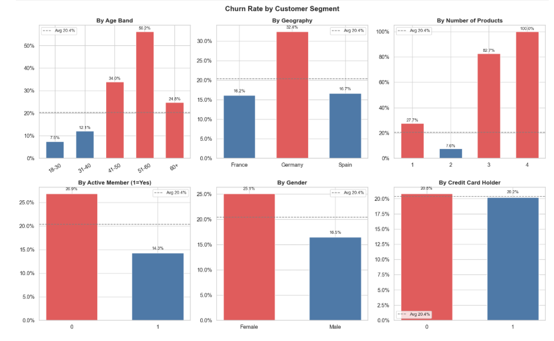
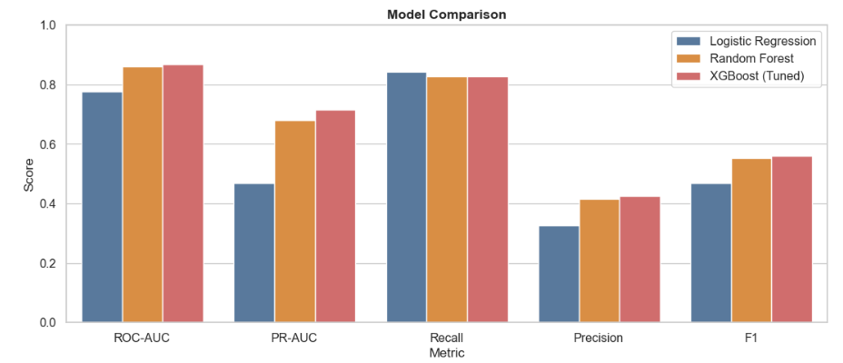
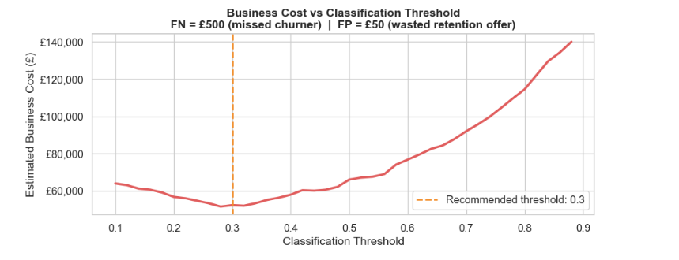
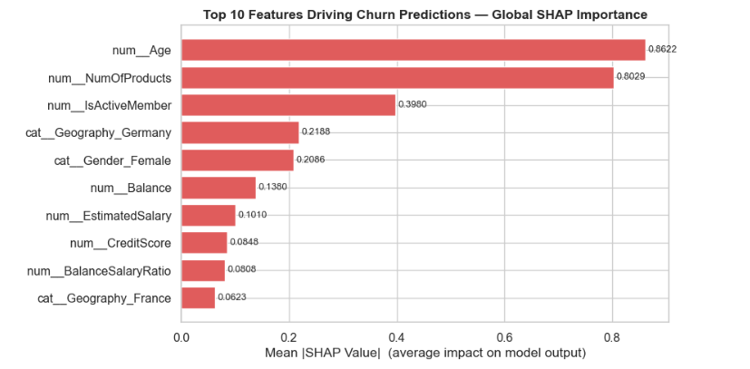

# Bank Customer Churn Prediction

A full machine learning pipeline that identifies customers at risk of leaving a retail bank — combining exploratory analysis, feature engineering, three-model comparison, business-cost-optimised threshold selection, and SHAP explainability to produce actionable retention recommendations.

> **This is not just a model.** It is a decision-support framework: it tells the retention team which customers to call, in which order, and why — grounded in the actual cost of getting it wrong.

---

## Screenshots

### Exploratory Findings
This visual summarises the clearest early churn patterns in the dataset, including geography, activity status, product holding, and age band.



### Model Performance Comparison
This chart compares the three models across the key evaluation metrics used in the project: ROC-AUC, Recall, Precision, and F1.



### Threshold Cost Curve
This visual shows why the final classification threshold was set to **0.3** instead of the default **0.5**. The selected threshold minimises expected business cost under the project's 10:1 false-negative to false-positive cost assumption.



### SHAP Feature Importance
This chart shows the **top 10 features** driving churn prediction in the final XGBoost model, making the model more interpretable and business-actionable.



---

## Key Insights

- **Risk is heavily concentrated in a small segment.** High-balance inactive customers (`IsHighValueInactive = 1`) churn at 31.2% — more than 10 percentage points above the 20.4% baseline. This is the single most actionable retention segment.
- **The 3+ products finding is counterintuitive and critical.** Customers holding three or more products churn at 82–100%. This is not a cross-sell success — it is a complexity or mis-selling problem that the bank needs to audit.
- **Germany is a structural issue, not a sampling artefact.** German customers churn at 32.4% — double France and Spain — and SHAP confirms this effect persists after controlling for age, engagement, and product holdings. It requires country-level investigation.
- **The default 0.5 threshold costs an extra £13,750 per 2,000 customers.** Moving to the business-optimal threshold of 0.3 — justified by the 10:1 cost ratio between missing a churner and a wrong retention offer — catches 60 more churners at the expense of 325 additional false alerts.
- **The model reduces estimated churn cost from £203,500 to £52,200 on the test set** — a saving of £151,300 — by correctly identifying 90% of churners before they leave.

---

## Project Structure

```text
bank-customer-churn-prediction/
├── data/
│   └── Churn_Modelling.csv
├── notebooks/
│   └── churn_prediction.ipynb
├── screenshots/
│   ├── eda-segments.png
│   ├── model-comparison.png
│   ├── threshold-cost-curve.png
│   └── shap-importance.png
├── README.md
├── requirements.txt
└── .gitignore
Run Locally
git clone https://github.com/OmotolaOsunkojo/bank-customer-churn-prediction.git
cd bank-customer-churn-prediction

pip install -r requirements.txt

jupyter notebook

Then open:

notebooks/churn_prediction.ipynb

The notebook expects Churn_Modelling.csv inside the data/ folder. Download it from Kaggle
 and place it there before running.

Dataset
Property	Detail
Source	Kaggle — Bank Customer Churn

Rows	10,000 customers
Target	Exited — 1 if churned, 0 if retained
Churn rate	20.4% (moderately imbalanced)
Geography	France, Germany, Spain

Raw features: CreditScore, Geography, Gender, Age, Tenure, Balance, NumOfProducts, HasCrCard, IsActiveMember, EstimatedSalary

Feature Engineering

Four business-motivated features were created on top of the raw columns:

Feature	Logic	Rationale
HasBalance	1 if Balance > 0	Zero-balance and positive-balance customers exhibit structurally different churn behaviour
BalanceSalaryRatio	Balance / (EstimatedSalary + 1)	Financial engagement relative to income — richer signal than balance alone
ProductsPerYear	NumOfProducts / max(Tenure, 1)	Product adoption speed, normalised by relationship length
IsHighValueInactive	Balance > median AND IsActiveMember = 0	Combines the two strongest churn signals; churns at 31.2% vs 20.4% baseline

AgeBand was created for EDA visualisation only and deliberately excluded from the model. Age enters as a continuous numeric, so adding ordinal bins would encode the same information twice and distort SHAP importance scores.

Modelling Pipeline

Three models were evaluated on the same test set using an 80/20 stratified split and a consistent evaluation framework that includes business cost — not just statistical metrics.

Why accuracy is excluded

With a 20.4% churn rate, a model that always predicts "Retained" achieves 79.6% accuracy and catches zero churners. Accuracy is excluded from all comparisons. The metrics that matter here are ROC-AUC, Recall, Precision, F1, and estimated business cost.

Business Cost Framework
Error type	Meaning	Cost
False Negative (missed churner)	Customer leaves uncontacted	£500
False Positive (wrong retention offer)	Wasted campaign spend	£50

The 10:1 cost ratio directly informs the threshold decision.

Results

All three models were evaluated at threshold = 0.4 for a consistent comparison. XGBoost was additionally evaluated at the business-optimal threshold of 0.3.

Model	ROC-AUC	Recall	Precision	F1	Est. cost
Logistic Regression	0.7765	84.3%	32.5%	0.470	£67,550
Random Forest	0.8610	82.8%	41.4%	0.552	£58,850
XGBoost (t = 0.4)	0.8670	82.8%	42.4%	0.561	£57,850
XGBoost (t = 0.3)	0.8670	89.9%	36.6%	0.520	£52,200
Doing nothing	—	0%	—	—	£203,500

Recommended model: XGBoost at threshold 0.3 — highest ROC-AUC, best recall, and lowest estimated business cost.

Threshold Strategy

The classification threshold is a business decision, not a statistical default. At threshold = 0.3:

41 churners are missed (FN) vs 101 at threshold = 0.5
634 non-churners are incorrectly flagged (FP) vs 309 at threshold = 0.5
catches 60 more churners at the expense of 325 additional false alerts
total estimated cost falls from £65,950 to £52,200

The full cost curve is plotted in the notebook, showing how total estimated cost varies across thresholds from 0.1 to 0.9.

SHAP Explainability

SHAP (SHapley Additive exPlanations) is used to explain both global model behaviour and individual predictions.

Global findings from the SHAP summary plot:

Feature	Effect
Age	Strongest predictor. High age → higher churn probability. 41–60 is the core risk cohort
NumOfProducts	Non-linear. 2 products = lowest risk. 1 or 3+ = high risk
IsActiveMember	Inactivity consistently increases churn probability. A lever the bank can pull
Geography (Germany)	Structural positive effect — persists after controlling for all other features
Gender (Female)	Moderate positive effect — female customers show elevated churn risk
Balance / HasBalance	Customers with a balance churn more — they have more options to leave

Individual waterfall charts are included for one high-risk and one low-risk customer, explaining exactly which features drove each score.

Business Recommendations

1. Priority segment: High-balance inactive customers
IsHighValueInactive = 1 identifies customers churning at 31.2% — these should be assigned to direct outreach, not automated email.

2. Age-targeted retention
Customers aged 40–60 show materially higher churn rates. Retention campaigns should be designed for this cohort specifically rather than using generic messaging.

3. Product audit for 3+ product customers
Churn rates of 82–100% suggest a complexity, servicing, or mis-selling issue rather than a cross-sell success story.

4. Germany-specific investigation
Germany's churn rate is double the other markets, and SHAP confirms this remains important after controlling for other features. This needs country-level commercial investigation.

5. Automated inactivity trigger
No activity for 60–90 days should trigger retention outreach. Inactivity is observable before churn is final and is one of the highest-leverage warning signs.

Operational Use
# Score monthly, flag at 0.3, sort by score, work top-down
scores = best_xgb.predict_proba(X_new)[:, 1]
at_risk = X_new[scores >= 0.30].copy()
at_risk["churn_score"] = scores[scores >= 0.30]
at_risk = at_risk.sort_values("churn_score", ascending=False)
Notebook Structure
Section	Content
1	Setup and imports
2	Business framing — metrics and cost assumptions
3	Load data
4	Exploratory data analysis — segment charts, distributions, correlation
5	Feature engineering — 4 new features with validation
6	Preprocessing pipeline — scaling, encoding, imputation
7	Evaluation framework — evaluate_model() and business_cost()
8	Baseline — Logistic Regression
9	Random Forest
10	XGBoost — hyperparameter tuning with RandomizedSearchCV
11	Threshold strategy — cost curve, threshold comparison, recommendation
12	Model comparison — ROC/PR curves, confusion matrix, cost table
13	SHAP explainability — global bar, summary plot, two waterfall charts
14	Business recommendations and operational guide
Stack
Layer	Tool
Data manipulation	pandas, numpy
Modelling	scikit-learn, XGBoost
Explainability	SHAP
Visualisation	matplotlib, seaborn
Environment	Jupyter Notebook
About

Built as a portfolio project to demonstrate a full machine learning workflow applied to a real business problem. All data comes from the public Kaggle Bank Customer Churn dataset.